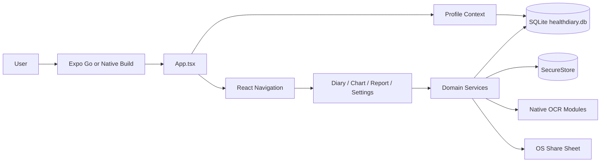
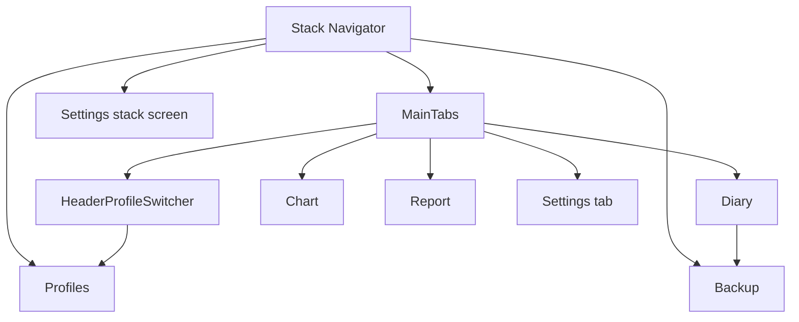
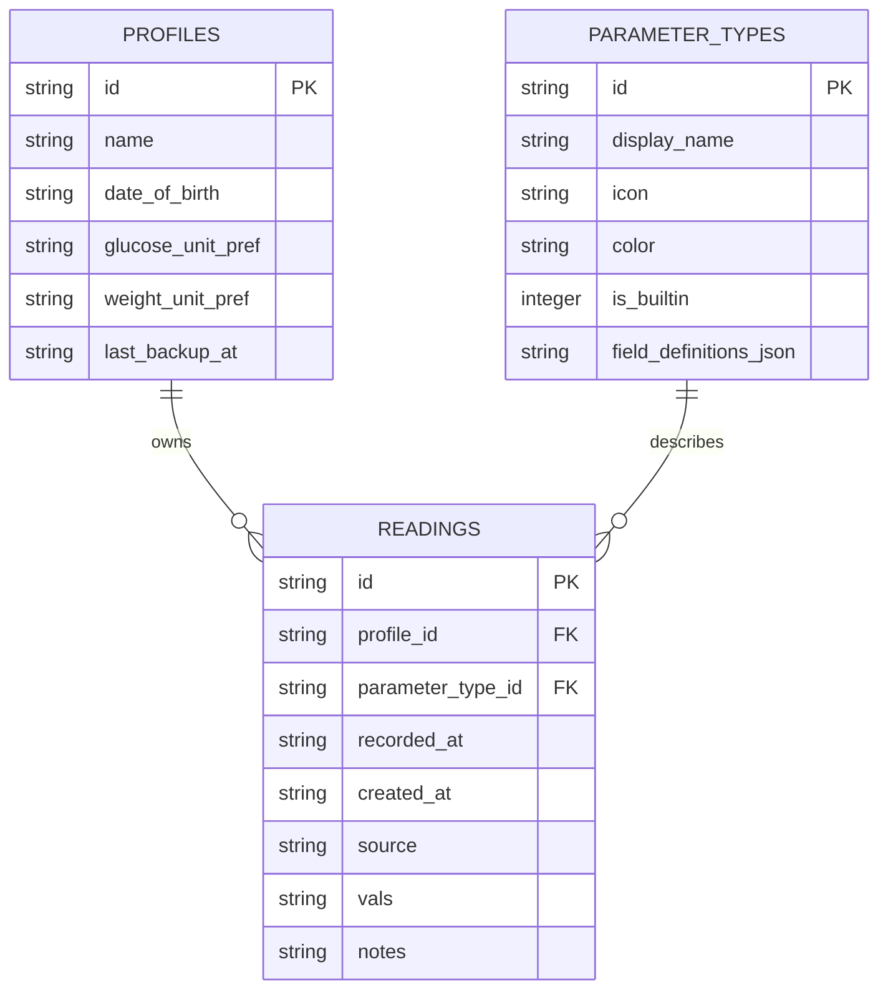
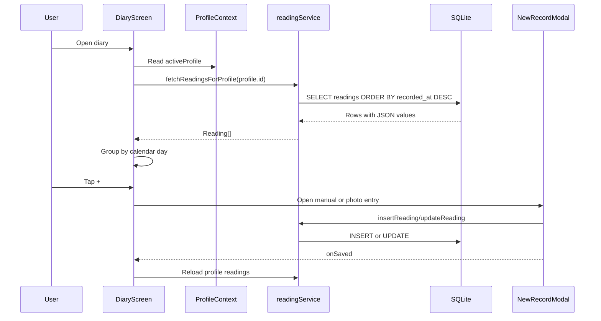
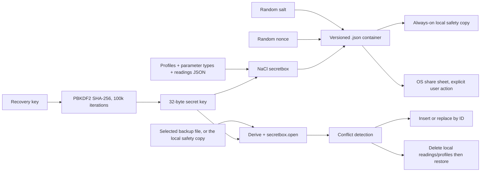

# HealthDiary Technical Design and Debugging Guide

## 1. Purpose

This document describes the current HealthDiary architecture, runtime flows, data contracts, native boundaries, build commands, and a repeatable debugging procedure. It is intended to let a developer answer three questions quickly:

1. Where does a user action enter the system?
2. Which layer owns the failure?
3. What is the cheapest reliable check that proves or disproves the suspected cause?

The application is an Expo SDK 57 React Native application. It stores health data locally in SQLite and only leaves the device when the user explicitly exports, shares, or uploads data.

## 2. System Context



### Technology inventory

| Area | Current implementation |
|---|---|
| Runtime | React Native 0.86.3, React 19.2.3, Expo 57 |
| Navigation | `@react-navigation/native`, bottom tabs, stack navigator |
| Local storage | `expo-sqlite` modern synchronous/asynchronous API |
| Secure values | `expo-secure-store` |
| Encryption | PBKDF2-SHA256 plus TweetNaCl `secretbox` |
| OCR | iOS Vision and Android ML Kit when native modules exist; filename heuristic fallback otherwise |
| Charts | `victory-native` |
| PDF | `expo-print` plus `expo-sharing` |
| Tests | Jest, `ts-jest`, Babel/Expo transforms |
| Native build | Checked-in Android project; iOS generated by prebuild when applicable |

## 3. Repository Map

| Path | Responsibility |
|---|---|
| `index.js` | Runtime polyfills and Expo root registration |
| `App.tsx` | Gesture-handler root, profile provider, navigation shell, profile switcher |
| `src/db/init.ts` | Opens SQLite, creates tables, seeds built-in parameter types |
| `src/db/seed.ts` | Seeds Blood Pressure and Glucose parameter definitions |
| `src/types/index.ts` | TypeScript contracts for profiles, readings, parameters |
| `src/services/profileContext.tsx` | Profile state and profile CRUD |
| `src/services/readingService.ts` | Reading CRUD and JSON value decoding |
| `src/services/parameterRegistry.ts` | Parameter type reads and field-definition decoding |
| `src/services/backup.ts` | Encrypted local backup creation, preview, and restore |
| `src/services/backupDestinations.ts` | Writes the always-on local safety copy (no cloud destinations) |
| `src/services/onboarding.ts` | Persists the first-run "new vs. existing user" choice |
| `src/services/pickAndReadBackupFile.ts` | Shared DocumentPicker + Android-read-bug-workaround for restore |
| `src/services/dataManager.ts` | Delete-all-data, including local backup files when asked |
| `src/services/crypto.ts` | Recovery key, PBKDF2, secretbox, SecureStore access |
| `src/services/ocr.ts` | Native OCR dispatch and fallback boundary |
| `src/services/ocrParsing.ts` | JavaScript OCR text parsing heuristics |
| `src/services/dataExport.ts` | Plain JSON and CSV exports |
| `src/services/pdf.ts` | HTML/SVG report generation and PDF sharing |
| `src/services/diagnosticsLog.ts` | Local diagnostic log and sharing |
| `src/screens/` | User-facing workflows |
| `src/components/` | Reusable modals and reading UI |
| `native/android/` | ML Kit OCR source templates |
| `native/ios/` | Vision OCR source templates |
| `plugins/vision-ocr-plugin/` | Config plugin that copies native OCR sources and patches Android ML Kit dependency |
| `__mocks__/` | Jest mocks for Expo/native modules |
| `__tests__/` | Unit and service tests |
| `e2e/` | Current placeholder E2E test |

## 4. Application Startup Flow

```mermaid
sequenceDiagram
    participant JS as index.js
    participant App as App.tsx
    participant DB as src/db/init.ts
    participant Provider as ProfileContextProvider
    participant Nav as NavigationContainer
    participant Screen as Initial screen

    JS->>JS: Install random-values and Buffer polyfills
    JS->>App: registerRootComponent(App)
    App->>DB: Import module; initialize SQLite schema synchronously
    DB->>DB: CREATE TABLE IF NOT EXISTS
    DB->>DB: Seed built-in parameter types
    App->>Provider: Mount provider
    Provider->>DB: Load profiles asynchronously
    App->>Nav: Mount stack and tabs
    Nav->>Screen: Render Diary tab
    Screen->>DB: Load readings and parameters for active profile
```

### Startup invariants

- `global.Buffer` must exist before crypto/backup code runs. This is installed in `index.js`.
- `react-native-get-random-values` must load before TweetNaCl generates recovery keys.
- SQLite schema creation runs when `src/db/init.ts` is loaded, before descendant React effects query tables.
- `GestureHandlerRootView` must wrap the app because `ReadingItem` uses `Swipeable`.
- The stack navigator is created with `createStackNavigator` from `@react-navigation/stack`.

### Startup debugging

1. Run `npx tsc --noEmit`. Fix syntax/import/type errors before opening Expo Go.
2. Run `npx expo export --platform android`. This forces Metro/Babel to process the reachable application graph.
3. If the app opens but shows no screen, inspect the first red-screen error and verify `App.tsx`, `src/db/init.ts`, and `index.js` before investigating feature screens.
4. If the error says `no such table`, confirm `initDB()` is executing and that `expo-sqlite` is using the modern API.
5. If Android gestures fail, confirm the root `GestureHandlerRootView`.

## 5. Navigation and Screen Flow



`HeaderProfileSwitcher` reads `useProfile()` and navigates to `Profiles`. `DiaryScreen` navigates to `Backup` when the backup reminder banner is selected. The app currently has both a Settings tab and a Settings stack route; changes to one settings presentation should be checked against the other.

## 6. Database Design

Database file: `healthdiary.db`.



### Storage rules

- `field_definitions` and `vals` are stored as JSON strings and parsed at service boundaries.
- `source` is one of `manual`, `photo`, or `bluetooth` according to the TypeScript model. Bluetooth is modeled but not currently implemented as a UI flow.
- IDs are UUID strings.
- Dates are ISO strings.
- SQLite writes use `runAsync`; reads use `getAllAsync` or `getFirstAsync`.
- Never reintroduce the removed callback API (`transaction`, `executeSql`, `openDatabase`) with Expo SQLite 57.

### Database debugging

| Symptom | Check |
|---|---|
| `no such table` | Confirm `src/db/init.ts` loaded and `CREATE TABLE` completed |
| Empty diary | Confirm `activeProfile` is set and query uses its ID |
| Broken field values | Inspect JSON stored in `readings.vals` and parsing in `readingService.ts` |
| Missing BP/Glucose types | Check `seedParameterTypes()` and the `parameter_types` table |
| Writes fail with bind error | Ensure no SQL parameter is `undefined`; use `null` for absent values |
| Data disappears after reinstall | Expected for local-only data unless a backup was exported |

## 7. Profile and Diary Flow



`NewRecordModal` obtains parameter definitions from `parameterRegistry.ts`, validates required fields, stores numeric/text/enum values, and writes an ISO timestamp. `ReadingItem` provides edit and swipe-to-delete behavior.

## 8. OCR Flow

```mermaid
flowchart TD
    Pick[PhotoEntryModal] --> Permission[Request camera permission]
    Permission --> Image[Camera or gallery image]
    Image --> OCR[processImageForReading(uri)]
    OCR --> IOS{Native iOS Vision available?}
    IOS -->|yes| Vision[VisionOCR.recognize]
    IOS -->|no| Android{Native Android ML Kit available?}
    Vision --> Result[OCRResult]
    Android -->|yes| MLKit[MLKitOCR.process]
    Android -->|no| Fallback[Parse URI/file name heuristic]
    MLKit --> Result
    Fallback --> Result
    Result --> Confirm[Prefill NewRecordModal]
    Confirm --> Save[User verifies and saves reading]
```

### OCR contract

```ts
type OCRResult = {
  parameterType: 'bp' | 'glucose' | 'unknown';
  values: Record<string, any>;
  confidence: number;
  rawText?: string;
};
```

Native OCR and JavaScript fallback do not currently have identical parsing behavior. Treat OCR output as a suggestion and require user confirmation before persistence.

### OCR debugging

1. Confirm the image picker result uses `canceled` and `assets[0].uri`.
2. Confirm camera/gallery permissions.
3. Check whether `NativeModules.VisionOCR` or `NativeModules.MLKitOCR` exists.
4. If absent, confirm the fallback is expected; Expo Go cannot execute custom native modules that are not included in its binary.
5. For Android native OCR, run prebuild, verify `MLKitOCR.kt` and `MLKitOCRPackage.kt`, then rebuild the native app.
6. For iOS, verify the Swift and Objective-C bridge files are included in the Xcode target.
7. Verify native OCR returns numeric values compatible with the parameter field definitions; Android currently writes some parsed values as strings.

### Native OCR configuration caveat

`plugins/vision-ocr-plugin/index.ts` exists and copies native source files, but `app.json` currently lists only `expo-splash-screen` in `plugins`. Native OCR should therefore be treated as unavailable until the plugin is explicitly configured and a native prebuild/rebuild confirms the modules are registered.

## 9. Backup, Restore, and Encryption



### Backup container

```json
{
  "version": 1,
  "salt": "hex",
  "nonce": "hex",
  "ciphertext": "hex"
}
```

### Backup creation

1. Load the recovery key from SecureStore.
2. Generate and store one if none exists.
3. Read all profiles, parameter types, and readings.
4. Parse JSON columns and serialize the payload.
5. Derive a key with PBKDF2-SHA256, 100,000 iterations.
6. Encrypt with TweetNaCl secretbox and a random nonce.
7. Write `healthdiary_backup.json` to the cache directory (the shareable copy).
8. Write the same content to the always-on local safety copy (`backupDestinations.ts`).
9. Update `profiles.last_backup_at`.
10. Sharing through the OS is a separate, later user action ("Share / Save Backup"), not part of creation.

### Restore

1. If the device already has a local safety copy (and thus the recovery key already stored), restore it directly — no picker, no key entry.
2. Otherwise, pick a file with DocumentPicker and read it via `pickAndReadBackupFile.ts` (Base64-then-decode, working around a still-open Android `expo-file-system` read bug), with the user typing their Recovery Key.
3. Decrypt and parse the payload.
4. Query local profile IDs.
5. If conflicts exist, show `RestoreOptionsModal`.
6. Merge uses `INSERT OR REPLACE` by ID. Replace deletes readings and profiles first.
7. Restore parameter types, profiles, and readings, then reload the profile context so the UI reflects the restored data immediately.

### Backup debugging

- `no PRNG`: confirm `react-native-get-random-values` is imported before the app and TweetNaCl.
- `Buffer is not defined`: confirm the `buffer` polyfill in `index.js`.
- Decryption failure: check the recovery key, salt, nonce, ciphertext, and container version.
- Restore reports success but UI is stale: confirm the restore path calls `reloadProfiles()` from `profileContext.tsx`.
- Manual restore "file isn't readable" on Android: known upstream `expo-file-system`/`expo-document-picker` bug (see comments in `pickAndReadBackupFile.ts`); not something to "fix" as app logic.
- Do not log recovery keys, plaintext payloads, or decrypted backup contents.

## 10. Local Backup Safety Copy and First-Run Onboarding

There is no cloud backup integration (Google Drive or otherwise) — an earlier OAuth-based Drive integration (`googleDriveBackup.ts`, `DriveBackupsScreen.tsx`) was fully removed in favor of two simpler, platform-identical mechanisms:

```mermaid
sequenceDiagram
    participant User
    participant Profiles as ProfileManager
    participant Modal as FirstRunKeyChoiceModal
    participant Crypto as crypto.ts
    participant Backup as backup.ts
    participant Dest as backupDestinations.ts

    User->>Profiles: Open Profiles with zero profiles, no onboarding choice yet
    Profiles->>Modal: Show first-run prompt
    alt New user
        Modal->>Modal: Record 'new' choice; key generated later on Backup screen
    else Existing user
        Modal->>Crypto: storeRecoveryKeyOnDevice(key), setRecoveryKeyConfirmed(true)
        opt Has the backup file handy
            Modal->>Backup: restoreEncryptedBackupFromFile(content, key)
        end
    end
    User->>Backup: Back Up Data
    Backup->>Dest: writeBackupToConfiguredDestinations(content, filename)
    Dest->>Dest: Write to documentDirectory/backups/ (always, both platforms)
```

- `backupDestinations.ts`'s local safety copy is unconditional and invisible — no folder picker, no per-platform branching (unlike the removed SAF-based Drive-folder design, this needs nothing platform-specific). It is what `readLocalBackupCopy()` / `localBackupCopyExists()` check for automatic restore.
- The recovery key itself is never regenerated automatically — `crypto.ts`'s `getRecoveryKeyConfirmed`/`setRecoveryKeyConfirmed` track a persisted confirmation flag (not just "a key exists") so Backup & Restore only reveals the key text again if the user explicitly says they haven't saved it.
- `onboarding.ts` persists the new-vs-existing choice once, keyed off "zero profiles and no choice recorded yet" in `ProfileManager.tsx` — not an app-wide launch gate, and not re-triggered by `deleteAllData()` (device/install history, not data state).

## 11. Reports, Charts, and Exports

- `ChartScreen` loads parameter types and readings, filters by selected type and range, and creates a Victory series for numeric fields.
- `ReportScreen` filters parameters and delegates to `generateReportPDF()`.
- `pdf.ts` generates inline SVG charts and HTML, then uses `expo-print` and `expo-sharing`.
- `dataExport.ts` creates plain JSON and CSV files. These exports are not encrypted.
- `diagnosticsLog.ts` writes to the app document directory and shares the log through the OS.

When debugging report/chart failures, first verify the input data shape (`recorded_at`, `vals`, numeric field keys), then isolate the renderer. A valid database query does not guarantee that Victory or `expo-print` accepts the resulting values.

## 12. Configuration and Native Builds

### Expo and native settings

- `app.json` defines the Expo identity, SDK version, platforms, Android package, and splash plugin.
- The checked-in Android project must agree with Expo's Hermes configuration.
- `android/gradle.properties` contains `hermesEnabled=true` and `expo.jsEngine=hermes`.
- `android/app/build.gradle` explicitly enables Hermes.
- Native source changes require a native rebuild; Metro reload alone cannot add a native module.

### Commands

```powershell
npm install
npx tsc --noEmit
npm test -- --runInBand
npx expo export --platform android
npm run start
npm run start:tunnel
npm run start:web
npx expo prebuild
npm run android
npm run ios
```

Use `npx expo export --platform android` as the definitive JavaScript syntax/module check. It processes the reachable application graph through Metro and Babel without requiring an emulator.

## 13. Debugging Playbook

### Triage order

1. **Classify the failure**: TypeScript, Metro/Babel, native build, runtime, data, permissions, network, or test-only.
2. **Capture the first error**: later errors are often cascading failures.
3. **Run the narrowest check**:
   - TypeScript/import issue: `npx tsc --noEmit`
   - JavaScript/module issue: `npx expo export --platform android`
   - Service regression: targeted Jest test
   - Full regression: `npm test -- --runInBand`
   - Native configuration: `npx expo prebuild` and native build
4. **Locate the owning boundary** using the flow diagrams above.
5. **Check inputs and contracts** before changing implementation.
6. **Reproduce after clearing stale state** only when justified: Metro cache, app install, SQLite data, or SecureStore token state.
7. **Retest the original failure path**, not only the changed file.

### Failure classification table

| Error shape | Likely owner | First check |
|---|---|---|
| `Identifier ... has already been declared` | Duplicate generated source | Inspect the named file for duplicate imports/declarations |
| `Unable to resolve module` | Dependency or Metro resolution | `npm ls <package>`, then `npx expo export --platform android` |
| `customConditions` / moduleResolution error | TypeScript config | `tsconfig.json` versus `expo/tsconfig.base.json` |
| `no such table` | DB initialization/lifecycle | `src/db/init.ts` and startup ordering |
| `undefined is not a function` in navigation | Navigator import/API mismatch | `App.tsx` navigator factory imports |
| `NativeModules.X is undefined` | Native binary/config plugin | Prebuild, native registration, rebuild; do not blame JS first |
| Permission denied | Device permission state | OS settings and permission request result |
| `Buffer` / `no PRNG` | Runtime polyfill initialization | `index.js` import order |
| Tests pass but device fails | Mock/native gap | Run Android export and a native build/device check |

### Clean-state procedures

Use these selectively, because they can erase useful evidence:

```powershell
# Clear Metro cache
npx expo start -c

# Reinstall JavaScript dependencies when lockfile/node_modules disagree
Remove-Item -Recurse -Force node_modules
npm ci

# Recreate native project when generated files are stale
npx expo prebuild --clean
```

Do not delete the SQLite database or SecureStore values during a data-loss investigation until the state has been backed up and the failure is recorded.

## 14. Testing Strategy

### Current automated coverage

- Crypto round-trip, wrong-key failure, and recovery-key confirmation-flag persistence.
- Encrypted backup creation/restore round-trip, local safety copy, and destination write-result handling.
- First-run onboarding choice persistence, and the shared DocumentPicker-read-with-retry helper.
- Delete-all-data (DB rows plus conditional local backup file deletion; Recovery Key untouched).
- OCR parsing and native OCR fallback behavior.
- PDF generation (report and recovery-key PDF) and diagnostics email/share fallback.
- Utility functions and unencrypted data export (JSON/CSV).
- Placeholder E2E test.
- All of the above runs via `npm test` (`jest.config.js`, ts-jest/babel-jest, no real `Platform`/`NativeModules`) and is service/utility-level only.
- **Component-level**: `npm run test:components` (`jest.component.config.js`, `jest-expo` preset + `@testing-library/react-native`) renders real screens/components against a real RN test environment. Currently covers `NewRecordModal` (required-field validation, out-of-range warnings, live BP classification, manual save, edit/update), `BackupScreen` (key reveal/hide/confirm state, automatic local restore vs. manual file+key restore), and `ConfirmDeleteAllModal` (DELETE-gated confirm, the separate "also delete local backup?" prompt only appearing when a backup exists). `npm run test:all` runs both suites. This is a separate, deliberately isolated config from `jest.config.js` — see that file's header comment for why (rendering needs a real Platform, the existing config's ts-jest/babel-jest setup doesn't provide one).
  - Gotchas specific to this config's RTL version: `render()` and every `fireEvent.*` call return a Promise and must be `await`ed, or state updates race the next assertion; a `Text` label built from nested `<Text>` children (e.g. a field label plus a separately-styled required-asterisk `<Text>`) won't match `getByText('Label')` exactly — use a regex instead.

### Required validation for a change

| Change area | Minimum validation |
|---|---|
| TypeScript/UI/import | `npx tsc --noEmit` and Android export |
| SQLite/service | Targeted service tests and full Jest suite |
| Encryption/backup | Crypto and restore tests with wrong-key and conflict cases |
| OCR JavaScript | OCR parsing tests and Android export |
| Native OCR | Prebuild plus Android/iOS native build and device test |
| Screen/component behavior | Add or update a `jest.component.config.js` test alongside manual verification |
| Navigation | Android export plus manual screen navigation |
| Build configuration | Android export and native build |

### Known test gaps

- Expo Go cannot prove custom Vision/ML Kit native modules are present.
- The E2E test is currently a placeholder, not a complete user workflow.
- Jest emits an OCR warning because its mocked React Native environment does not provide a full `Platform`/`NativeModules` implementation (service-level config only — the component-level config doesn't have this gap).
- Component-level coverage is new and only spans 3 of 6 screens and 3 of 8 components (see above) — the rest (`ChartScreen`, `DiaryScreen`, `ProfileManager`, `ReportScreen`, `SettingsScreen`, `ErrorBoundary`, `FirstRunKeyChoiceModal`, `PhotoEntryModal`, `ReadingItem`, `ReadingsChart`, `RestoreOptionsModal`) still rely on manual/web-preview verification only.
- There is no automated migration test for an existing SQLite database.
- There is no crash-reporting or production telemetry by design.

## 15. Security and Privacy Boundaries

- Local SQLite data is not encrypted by this design; encrypted protection begins when creating a `.json` backup container.
- Plain JSON/CSV exports are intentionally unencrypted and must be treated as sensitive.
- Recovery keys must never be logged.
- Backup files contain profiles and readings; sharing or uploading is an explicit user action.
- The app has no analytics, account system, or automatic upload path.
- Formal HIPAA/GDPR compliance still requires legal and operational review beyond this codebase.

## 16. Change Checklist

Before merging a change:

- [ ] Identify the owning flow and contract.
- [ ] Preserve the modern Expo SQLite API (`runAsync`, `getAllAsync`, `execSync`, etc.).
- [ ] Avoid `undefined` SQLite bind values; use `null` for absent fields.
- [ ] Avoid logging health data, recovery keys, or tokens.
- [ ] Update or add a focused test for changed service behavior.
- [ ] Run `npx tsc --noEmit`.
- [ ] Run `npm test -- --runInBand`.
- [ ] Run `npx expo export --platform android`.
- [ ] For native changes, run prebuild and a native device/emulator build.
- [ ] Verify the original user flow manually when the change affects UI or native behavior.
